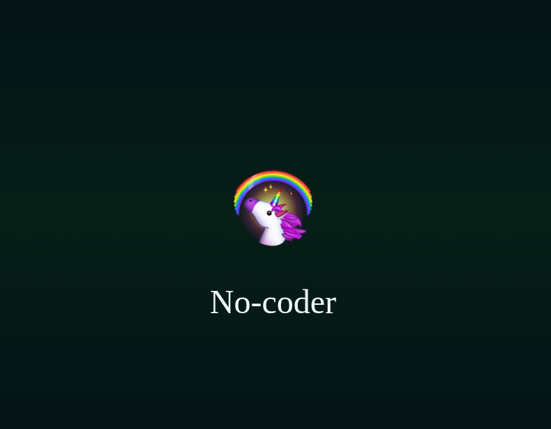

[ contém humor ]

Tecnologia brasileira que utiliza um **sonar trans** para detectar *wokes* em ambiente terreste ( radar )

> Calibrado para os seguintes tipos

- [X] "eu codo"
- [X] "Coda fofo"
- [X] "Engenheiro de prompt"
- [X] "Low coder"
- [X] "No coder"
- [X] "Vibe coder"

> Recursos adicionados

- [X] Animações
- [X] Áudio
- [X] Emojis
- [X] Javascript

## Créditos

Áudio: *desconhecido*

Emojis: [Telegram](https://telegram.org)

Sonar: [Nikola Betica](https://dev.to/nikolab/animated-sonar-screen-css-only-3p9f)
